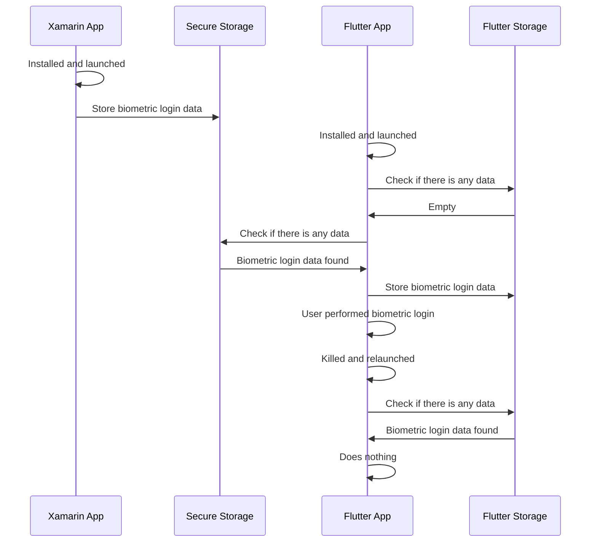

```mermaid
sequenceDiagram
    participant Xamarin App
    participant Secure Storage
    participant Flutter App
    participant Flutter Storage
    Xamarin App->>Xamarin App: Installed and launched
    Xamarin App->>Secure Storage: Store biometric login data
    Flutter App->>Flutter App: Installed and launched
    Flutter App->>Flutter Storage: Check if there is any data
    Flutter Storage->>Flutter App: Empty
    Flutter App->>Secure Storage: Check if there is any data
    Secure Storage->>Flutter App: Biometric login data found
    Flutter App->>Flutter Storage: Store biometric login data
    Flutter App->>Flutter App: User performed biometric login
    Flutter App->>Flutter App: Killed and relaunched
    Flutter App->>Flutter Storage: Check if there is any data
    Flutter Storage->>Flutter App: Biometric login data found
    Flutter App->>Flutter App: Does nothing
```

Open Question: Should flutter app remove secure storage's data when it migrated data to flutter storage?